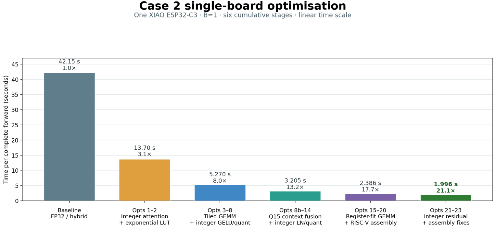
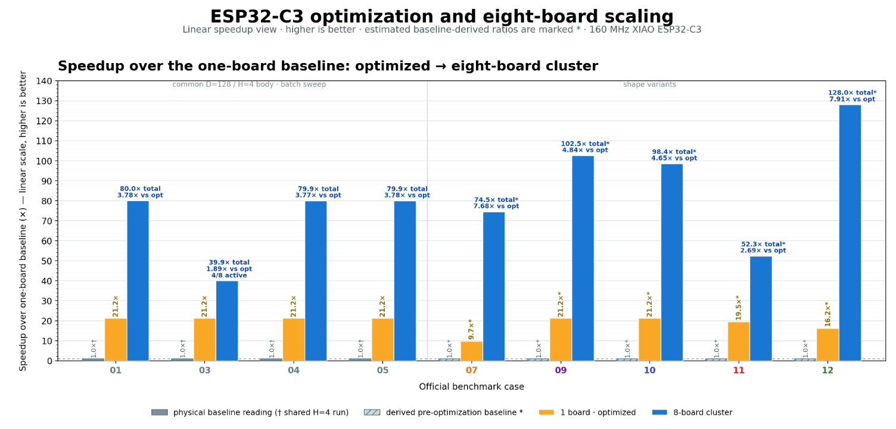

# NotGPU Attention: Transformers on S$7 Microcontrollers

**Team:** TinyCluster — Karthik Gangula, Mingchen Yang, and Yuma Ochi

**Repository:** https://github.com/chizuchizu/techjam2026

## One-line description

A complete, numerically validated Transformer forward pass optimized for a no-FPU
ESP32-C3, then scaled from one S$7 microcontroller to a wireless cluster of eight.

## Project overview

The competition asks teams to optimize Transformer execution while preserving the
output of the provided PyTorch reference. Most solutions begin with a GPU and try to
use it more efficiently. We explored the opposite extreme: **how much of the same
Transformer can survive when the GPU is removed entirely?**

Our target is the Seeed XIAO ESP32-C3, a single-core 160 MHz RISC-V microcontroller
with no hardware floating-point unit, no PSRAM, about 321 KB of usable application
SRAM, and 4 MB of flash. It costs about S$7. These constraints make the expensive
parts of a Transformer—matrix multiplication, softmax, activation storage, and
communication—impossible to hide behind conventional GPU hardware.

We built an end-to-end implementation of the competition's pre-LayerNorm Transformer
body on this device. The implementation preserves causal multi-head attention,
residual connections, LayerNorm, GELU, and the feed-forward network. Its outputs are
checked against the official PyTorch reference using the competition's exact
correctness rule.

For the main case-2 shape, one complete four-layer forward pass improved from
**42.15 seconds to 1.996 seconds on one ESP32-C3: a measured 21.1x speedup**. We then
split the same complete forward across two boards and reached **1.276 seconds**, or
**1.56x faster than the optimized single board and 33.0x faster than the original
baseline**. For batch workloads, the eight-board cluster achieved essentially linear
**8.00x scaling against one identical Wi-Fi-capable worker**.

This is not a claim that a microcontroller replaces a data-center GPU or runs a large
language model. It is a reproducible study of how Transformer kernels, memory layout,
and parallelism change when every byte and every instruction matters.


*The physical eight-board cluster used for the reported wireless measurements.*

## How the solution addresses the problem statement

The benchmark permits a customized implementation as long as it returns the required
output shape and remains numerically close to the reference. We address that contract
in four ways:

1. **Preserve the model, change the execution.** We keep the full Transformer formula
   but replace slow floating-point inner loops with validated fixed-point kernels.
2. **Optimize from measurements.** We profile complete forwards, identify the current
   bottleneck, make one change, and run the correctness gate before accepting it.
3. **Use shape-aware parallelism.** Independent batch inputs use data parallelism;
   the batch-one case uses a token-row split inside the model.
4. **Report evidence honestly.** Physical measurements, derived values, and
   projections are labelled separately. Host input/output time is excluded from the
   device-compute figures consistently and reported separately where available.

The official reference uses deterministic random weights and inputs rather than a
trained dataset. Therefore, correctness in this project means **numerical equivalence
to the reference**, not task accuracy. An output element passes when its absolute
error is at most `0.002` **or** its relative error is at most `0.02`, and all values
must be finite.

## What we built

### 1. A fixed-point Transformer for a processor without an FPU

The baseline spent 30.09 of its 42.15 seconds inside attention. On the ESP32-C3,
floating-point arithmetic is implemented in software, so float operations inside QK,
softmax, and PV were the first major bottleneck.

We use Q15 activations, Q12 weights, integer GEMMs, and wide integer accumulators where
attention requires additional range. Softmax keeps the stable subtract-maximum
formulation, but replaces repeated `expf` calls with a 513-entry exponential lookup
table and linear interpolation. This removes software floating point from the hottest
inner loops while retaining per-buffer scaling for numerical accuracy.

### 2. Register-aware and hand-scheduled RISC-V kernels

The C3 has 32 architectural registers, with roughly 28 available to the inner kernel
after ABI and loop state. A large `8 x 2` GEMM output tile exposes useful reuse but
creates more than 36 live values, forcing stack spills inside the reduction loop. We
selected a `4 x 2` tile that produces eight outputs with two-column reuse while
keeping the live set near 20 registers.

We also hand-scheduled independent multiply-accumulate chains in RISC-V assembly.
Instead of immediately consuming a multiplication result and stalling the in-order
core, the kernel works on other independent accumulators while that result becomes
ready. The head-GEMM kernel became 21.5% faster while remaining bit-exact.

### 3. Operator fusion and fewer memory passes

The original path repeatedly converted, stored, reread, and requantized the same
activation. We keep the residual stream in int32 at a fixed scale and fold bias,
scaling, and the residual update into the GEMM epilogue. This removes complete buffer
passes, reduces the epilogue from roughly 268 instructions per output to about ten,
and requires no additional SRAM.

The same principle is applied across LayerNorm, GELU, quantization, and projection:
keep intermediate values in the representation needed by the next consumer and avoid
materializing a full tensor when a fused or tiled path is sufficient.

### 4. A memory schedule that fits beside Wi-Fi

The fast single-board model and the Wi-Fi/lwIP stack could not coexist in SRAM. The
first combined build overflowed the linker region, and the estimated static plus
runtime demand was about 429 KB against a roughly 328 KB Wi-Fi build region.

We implemented a 16-row, head-sequential forward that shortens buffer lifetimes and
reuses scratch space. The Wi-Fi-capable build uses 173,060 bytes of static DRAM and
leaves 98,380 bytes free after association. This makes wireless data-parallel workers
possible on the same no-PSRAM device.

There is a deliberate trade-off: the tiled Wi-Fi worker takes about 4.215 seconds per
forward, compared with 1.990 seconds for the faster untiled build. We therefore report
both 8.00x scaling versus one identical tiled worker and the fair improvement versus
the fastest untiled single-board firmware.

### 5. Two parallelization strategies

**Batch data parallelism.** Each board stores a complete model and receives independent
inputs from a host coordinator over persistent TCP. The workers do not exchange
tensors during a forward, so useful parallelism is limited by the smaller of batch
size and board count. Cases with at least eight inputs scale almost linearly across
eight boards.

**Token-row parallelism.** Case 2 has batch size one, so data parallelism cannot use
multiple boards. We instead divide alternating token rows between two boards. This
balances the uneven work caused by the causal attention triangle. Most operations run
locally; the boards exchange only the keys and values required by attention. A
dedicated communication task overlaps this exchange with computation, producing a
complete two-board forward that is 1.56x faster than the optimized single-board path.

The parity-interleaving idea is related to published Striped Attention. We do not
claim to have invented that general algorithm. Our contribution is its fixed-point,
memory-bounded, communication-overlapped realization as a complete Transformer on two
no-FPU ESP32-C3 boards.

### 6. Reproducible profiling and validation

We built `tinyprof`, an operator-level profiler for the ESP32-C3. It records exclusive
and inclusive operator timing from the cycle counter, call counts, instrumentation
overhead, heap and stack watermarks, ELF-derived static memory, embedded weight sizes,
and modelled traffic based on measured calls. It produces machine-readable artifacts
and a self-contained comparison report.

Every optimized path is tested against the same PyTorch-generated references before
its performance result is accepted. Raw measurements are stored with the code as
JSON, logs, and Markdown reports rather than copied only into presentation slides.

## Results

The main results below cover the complete four-layer Transformer body. Device-compute
timing excludes host input/output for every row so the comparisons use the same scope.

| Configuration | Complete-forward time | Improvement | Evidence |
|---|---:|---:|---|
| Case 2, original firmware, 1 C3 | 42.15 s | 1.00x | Physical measurement |
| Case 2, optimized firmware, 1 C3 | 1.996 s | **21.1x** | Physical measurement; gate passes |
| Case 2, token-row split, 2 C3s | 1.276 s | **33.0x vs baseline; 1.56x vs optimized** | Physical complete forward; gate passes |
| Case 1, 4 tiled Wi-Fi workers | 67.465 s | 4.00x vs one tiled worker | Physical measurement |
| Case 1, 8 tiled Wi-Fi workers | 33.713 s | **8.00x vs one tiled worker** | Physical measurement; 64/64 pass |



*The cumulative Case 2 optimization path on one ESP32-C3.*

Across the case 1–5 eight-board sweep, all **213/213** forwards completed with
no missing inputs and no failing output elements. The same shape-aware data-parallel
approach was also physically validated on cases 7 and 9–12. Cases 1, 4, and 5 obtain
about **3.78x** more compute throughput on eight tiled workers than the fastest
untiled one-board implementation after accounting for the tiled worker's local
overhead.

Some large cross-case speedups use a FLOP-normalized estimate of a baseline that could
not run on the device. Those figures are marked as projections in the repository and
are not used as the primary measured headline here.



*Measured optimized and eight-board results across the completed official cases.
Asterisks identify ratios that depend on a derived pre-optimization baseline.*

## Why this was difficult

- **No hardware floating point:** common Transformer math becomes a sequence of slow
  software routines unless the numeric pipeline is redesigned.
- **Very little SRAM:** the model must share a few hundred kilobytes with framework,
  network, heap, stack, and temporary tensor state.
- **Flash is capacity, not fast working memory:** weights fit in flash, but kernel
  schedules must tolerate streaming and cache behavior.
- **Causal attention is uneven:** a simple contiguous token split leaves one worker
  with much more attention work than the other.
- **Communication can erase parallel speedup:** K/V exchange must be small, reliable,
  and overlapped with compute.
- **Approximation is constrained:** every quantization, lookup table, fusion, and
  reordering must remain inside the official per-element error gate.

## Innovation and contribution

Our contribution is the co-design of numeric representation, kernel schedule, memory
layout, and wireless parallelism for a particularly constrained target:

- a complete four-layer Transformer body on a no-FPU, no-PSRAM ESP32-C3;
- a measured 21.1x single-board optimization path with per-step validation;
- register-aware C and RISC-V assembly kernels designed around the real live-register
  budget;
- an SRAM-safe Wi-Fi execution schedule with measured post-association headroom;
- complete two-board token-row execution with communication overlap;
- physical eight-board data-parallel validation; and
- reproducible profiling, raw results, and explicit measured-versus-projected labels.

Prior work has studied Tiny Transformers and distributed Transformer inference on
microcontrollers. We therefore avoid broad “world first” claims. What distinguishes
this project is the open, evidence-backed integration on inexpensive ESP32-C3 boards
under the exact numerical contract of the competition.

## Impact and practical relevance

This work is relevant to small sensor and control systems that benefit from local
sequence processing:

- wearable or environmental time-series analysis;
- industrial sensors that must react without a cloud round trip;
- privacy-sensitive signals that should remain at the network edge;
- low-cost education and research clusters; and
- offline deployments with intermittent connectivity.

The current benchmark is not itself a finished application, but it demonstrates the
building blocks: local attention, deterministic execution, bounded memory, validated
approximation, and scale-out across low-cost nodes. The implementation is fully local;
no cloud inference API is required at runtime.

## Development tools used

- **PlatformIO** for dependency management, building, flashing, build environments,
  memory reports, and serial monitoring.
- **Arduino CLI** for additional ESP32-C3 build and upload workflows.
- **Git and GitHub** for version control, experiment history, review, and publishing.
- **GNU Make and GCC toolchains** for native host tests and C/C++ validation.
- **RISC-V GCC/binutils** for assembly output, ELF/map inspection, and kernel analysis.
- **Python 3 command-line tools** for exporting test vectors, coordinating boards,
  validating outputs, collecting profiles, and generating reports.
- **Serial and network test harnesses** for repeatable USB, TCP, UDP, and ESP-NOW
  experiments.

## APIs and AI development tools used

- **OpenAI Codex** was used as a development assistant for repository analysis,
  implementation candidates, debugging support, experiment design, code review, and
  technical documentation.
- **Anthropic Claude Code** was used for alternative design review, explanation and
  presentation refinement, and feedback on implementation and communication choices.
- **Arduino-ESP32 networking APIs** provide Wi-Fi station/SoftAP operation, TCP, UDP,
  and ESP-NOW experiments.
- **FreeRTOS APIs** provide the asynchronous communication task used to overlap network
  transfer with model computation.
- **ESP-IDF/ESP32 system APIs** provide cycle timing, heap information, Wi-Fi control,
  and low-level device measurements.
- **PyTorch APIs** instantiate the official reference model and generate deterministic
  weights, inputs, and expected outputs.

Codex and Claude Code were part of the development workflow only. No AI assistant or
external model API is called by the final firmware. AI-proposed changes were accepted
only after compilation, host validation, physical-device measurement where claimed,
and the official numerical gate.

## Libraries and frameworks used

- **Arduino-ESP32 / ESP-IDF components** for the embedded runtime, Wi-Fi, lwIP, USB
  serial, timing, and FreeRTOS integration.
- **PyTorch** for the competition reference implementation and reference tensors.
- **NumPy** for tensor export, binary conversion, numerical comparison, and analysis.
- **pySerial** for board discovery, commands, tensor transfer, and result collection.
- **Matplotlib** for scientific benchmark figures and presentation assets.
- **C and C++ standard libraries** for the embedded model, kernels, host tests, and
  protocol implementations.

We did not use Hugging Face Transformers, TensorFlow, scikit-learn, pandas, or a
hosted inference service in the final implementation.

## Datasets and assets used

**No external dataset was used.** The organizers supplied
`torch_transformer_benchmark.py`, which constructs the Transformer, initializes
weights from deterministic random seeds, and generates random inputs. The same weights
are copied into the reference and optimized paths. We export those tensors into binary
test fixtures and embedded Q12 weight blobs for the ESP32 firmware.

Project-generated assets include:

- raw serial captures, JSON benchmark results, and validation logs;
- ELF files and linker maps used for memory evidence;
- original Matplotlib charts generated from repository measurements;
- photographs of the team's physical ESP32-C3 boards and eight-board setup; and
- hand-drawn presentation illustrations created for this project.

Research papers and third-party projects are cited in `docs/PRIOR_ART.md`; their
results are used for context, not represented as our measurements.

## What we learned

The biggest lesson was that optimization is a moving target. After fixed-point
attention removed the initial hotspot, GEMM register pressure became dominant. After
the compute path became fast, memory layout determined whether networking could fit.
After networking fit, the per-worker tiling overhead changed the fair cluster
comparison. A useful optimization process must therefore measure the complete system
after every major change rather than optimizing one kernel in isolation.

We also learned that more parallel hardware does not guarantee speedup. Batch
parallelism is almost free because workers exchange no tensors, while a single-input
Transformer needs a decomposition that balances causal work and hides K/V traffic.

## Limitations

- The official benchmark uses random weights and inputs; we have not demonstrated a
  trained downstream sensor model.
- Full official coverage is incomplete for cases 6, 8, 13, and 14. Bounded streaming
  and ring-attention experiments exist for the larger shapes, but they are not reported
  as complete official-case results.
- The Wi-Fi-capable tiled worker is slower than the fastest radio-free worker, so node
  scaling and speedup versus the best single board are reported separately.
- Device-compute results exclude host transfer by convention. End-to-end numbers are
  recorded separately and depend on the host transport.
- We have not yet measured joules per forward with an external power instrument.
- The cluster is a benchmark prototype, not a hardened production network; deployment
  would require stronger discovery, authentication, job-level retry, and failure
  recovery.

## What's next

1. Apply the optimized communication path without forcing the slower tiled schedule on
   each compute worker.
2. Extend online or ring attention to complete long-sequence official cases with
   bounded memory.
3. Add weight and feature sharding for models whose matrices do not fit in one board's
   flash partition.
4. Investigate int8 kernels while retaining the same numerical gate.
5. Measure energy per forward and compare cost, latency, and energy with ESP32-S3,
   laptop CPU, and GPU baselines.
6. Demonstrate the kernels with a small trained time-series or sensor model.
7. Harden fleet discovery, authentication, retries, and fault handling.

## Reproducibility

The repository contains the official problem statement, reference script, firmware,
host tests, per-case documentation, raw measurements, and reproduction commands.

Quick host validation:

```bash
python3 -m venv .venv
.venv/bin/pip install -r requirements.txt
make check
```

Build the main optimized case-2 firmware:

```bash
cd benchmarks/case-02/optimisation/esp32-baseline
python3 tools/export_case2.py --outdir . --seeds 25
pio run -e esp32-baseline
```

The detailed benchmark index is in `benchmarks/README.md`, and the engineering report
is in `docs/report/index.html`.

## Devpost submission note

Before final submission, add the public demonstration video URL and confirm individual
team-contribution lines with all three team members. Those details are intentionally
not invented in this report.
