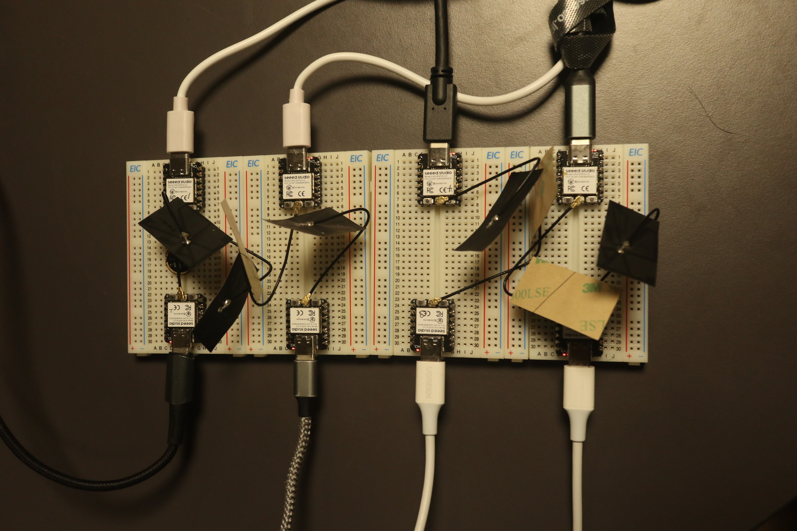
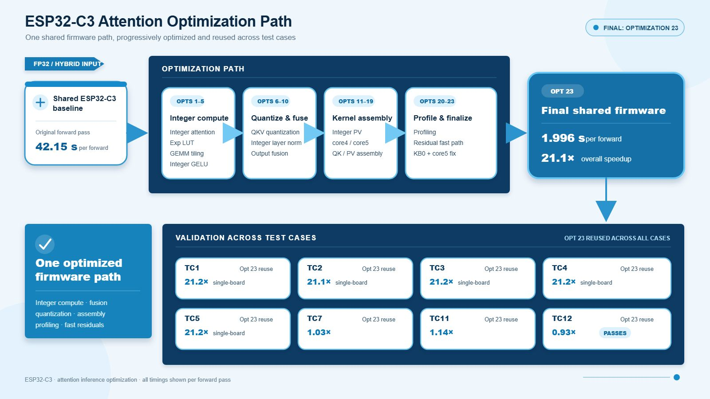
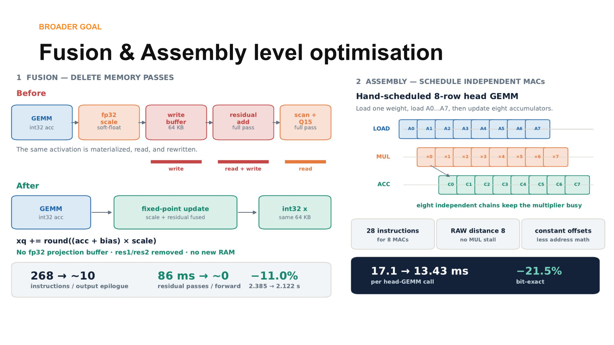
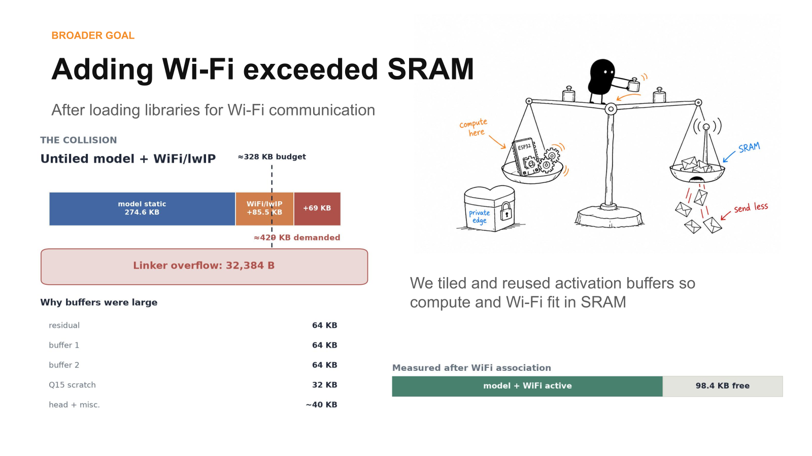
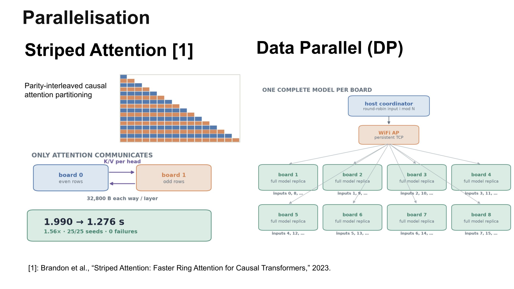
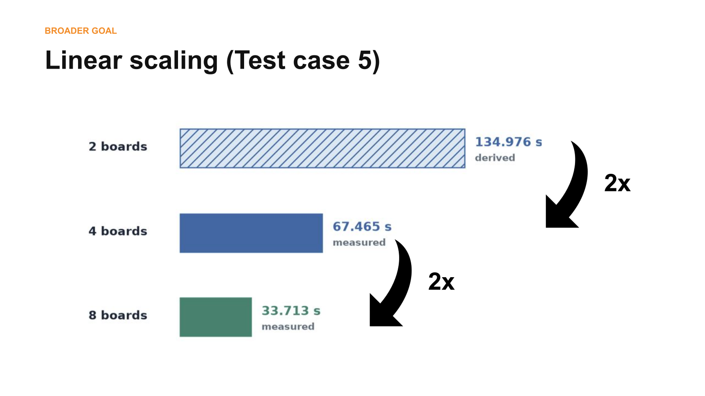

# NotGPU Attention

**Concise Technical Project Report**

**Team:** TinyCluster — Karthik Gangula, Mingchen Yang, and Yuma Ochi

**Repository:** [github.com/chizuchizu/techjam2026](https://github.com/chizuchizu/techjam2026)

NotGPU Attention is a complete, numerically validated Transformer forward pass optimized for a no-FPU ESP32-C3 and scaled from one **S$7 microcontroller** to an eight-board wireless cluster.

| Target | Specification |
|---|---|
| Processor | Single-core RV32IMC RISC-V at 160 MHz |
| Floating point | No hardware FPU; floating point is software-emulated |
| Memory | About 321 KB usable application SRAM; no PSRAM |
| Storage | 4 MB flash |
| Model | Four-layer pre-LayerNorm Transformer body |
| Validation | Elementwise absolute error ≤ 0.002 **or** relative error ≤ 0.02 |

---

## How our solution addresses the problem statement

The challenge asks teams to accelerate a Transformer while preserving the output of the supplied PyTorch reference. We keep the full model structure—causal multi-head attention, LayerNorm, residual connections, GELU, and the feed-forward network—but redesign its execution for an extremely constrained processor.

- **Remove the main arithmetic bottleneck.** Q15 activations, Q12 weights, integer GEMMs, and a stable lookup-table softmax replace software-emulated floating point in the hottest loops.
- **Use the processor efficiently.** A register-aware 4×2 GEMM tile avoids spills, while hand-scheduled RISC-V multiply-accumulate chains hide pipeline latency.
- **Reduce memory traffic.** Fused GEMM epilogues combine bias, scaling, residual updates, and requantization instead of repeatedly materializing full tensors.
- **Make networking fit.** Row tiling, shorter buffer lifetimes, and scratch-buffer reuse create enough SRAM for Wi-Fi and the model to coexist.
- **Select parallelism by shape.** Batch workloads use data parallelism; batch-size-one Case 2 uses an alternating token-row split and overlaps K/V exchange with computation.
- **Preserve correctness.** Every accepted optimization is compared with the official PyTorch output using the competition's exact numerical gate.

---

## Technical implementation

### Single-board optimization

The original Case 2 forward required **42.15 s**, with attention responsible for most of the runtime. Fixed-point attention and the exponential lookup table removed the largest floating-point cost. Register tiling, loop reordering, fusion, and hand-written assembly then reduced the complete forward to about **1.99 s** on one board—a measured **21.1× speedup**.

The 4×2 GEMM tile holds eight output accumulators while staying within the ESP32-C3 register budget. The assembly kernel interleaves independent multiply-accumulate chains so the in-order core performs useful work while multiplication results become available.

### Multi-board execution

Adding the Wi-Fi/lwIP stack initially exceeded SRAM. A 16-row, head-sequential schedule overlays activation buffers and reuses scratch memory, allowing communication and inference to run together.

The project uses two parallel strategies:

- **Batch data parallelism:** each worker stores the complete model and processes independent inputs. Workers exchange no intermediate tensors, so sufficiently large batches scale almost linearly.
- **Token-row split:** Case 2 has batch size one, so data parallelism cannot help. Two boards process alternating causal-attention rows, exchange only the required K/V data, and overlap communication with projection and attention compute. The complete forward improves from **1.990 s to 1.276 s**.

The measured cluster uses Wi-Fi. UDP with NAK-based recovery supports bulk cluster traffic, TCP is retained in two-board validation paths, and ESP-NOW is evaluated by the link experiments rather than used as the main eight-board benchmark protocol.

---

## Results

| Case | Baseline, 1 C3 | Optimized, 1 C3 | Parallel result | Total speedup |
|---|---:|---:|---:|---:|
| 01 | 2,697.6 s projected | 127.36 s | 33.713 s, 8 C3s | **80.0×** |
| 02 | 42.15 s measured | 1.990 s | 1.276 s, 2 C3s | **33.0×** |
| 05 | 5,395.2 s projected | 254.72 s | 67.451 s, 8 C3s | **80.0×** |
| 07 | 295.05 s estimated | 30.427 s | 3.963 s, 8 C3s | **74.5×** |
| 12 | 547.95 s estimated | 33.879 s | 4.282 s, 8 C3s | **128.0×** |

All optimized and parallel times above are physical device measurements. Projected or estimated pre-optimization baselines are labelled explicitly. Host transfer is excluded consistently from device-compute timing.

For batch-parallel Case 5, two, four, and eight identical Wi-Fi workers deliver nearly ideal **2×, 4×, and 8× node scaling**. Against the fastest untiled single-board firmware, the fair eight-board gain is approximately **3.78×** because Wi-Fi-compatible workers use a slower memory-saving schedule.

---

## Development tools used

- **PlatformIO** for dependency management, builds, flashing, memory reports, and serial monitoring.
- **Arduino CLI** for additional ESP32-C3 build and upload workflows.
- **Git and GitHub** for version control, experiment history, review, and publication.
- **GNU Make, GCC, and RISC-V binutils** for host tests, cross-compilation, assembly inspection, and ELF/map analysis.
- **Python 3 command-line tools** for exporting tensors, coordinating boards, validating outputs, collecting profiles, and generating figures.

## APIs and AI development tools used

- **OpenAI Codex** supported repository analysis, implementation, debugging, experiment design, review, and technical documentation.
- **Anthropic Claude Code** supported alternative design review, explanation, and presentation refinement.
- **Arduino-ESP32 networking APIs** provide Wi-Fi station/SoftAP operation, TCP, UDP, and ESP-NOW experiments.
- **FreeRTOS APIs** provide asynchronous communication tasks used to overlap network transfer with computation.
- **ESP-IDF system APIs** provide cycle timing, heap measurements, and low-level Wi-Fi/device control.
- **PyTorch APIs** instantiate the official reference model and generate deterministic inputs, weights, and expected outputs.

Codex and Claude Code were development assistants only. The final firmware calls **no hosted AI or cloud inference API**. Suggested changes were retained only after compilation, numerical validation, and physical measurement where claimed.

## Libraries and frameworks used

- **Arduino-ESP32, ESP-IDF components, FreeRTOS, and lwIP** for the embedded runtime, networking, timing, and task scheduling.
- **PyTorch** for the official reference implementation and reference tensors.
- **NumPy** for tensor export, binary conversion, numerical comparison, and analysis.
- **pySerial** for board discovery, commands, tensor transfer, and result collection.
- **Matplotlib** for scientific benchmark figures and presentation assets.
- **C/C++ standard libraries** for firmware, kernels, host tests, and protocol implementations.

We did not use Hugging Face Transformers, TensorFlow, scikit-learn, pandas, or a hosted inference service in the final implementation.

## Datasets and assets used

**No external dataset was used.** The organizers supplied `torch_transformer_benchmark.py`, which builds the Transformer and produces deterministic random weights and inputs. We export those tensors as binary test fixtures and quantized weight blobs, then compare device outputs against the corresponding PyTorch reference.

Project-generated assets include:

- raw serial captures, JSON benchmark results, and numerical validation logs;
- ELF files and linker maps used for memory evidence;
- Matplotlib charts generated from repository measurements;
- photographs of the physical ESP32-C3 boards and eight-board cluster; and
- original presentation diagrams and the slide figures reproduced in this report.

Research papers and third-party implementations are cited in `docs/PRIOR_ART.md`; their results provide context and are not presented as our measurements.

## Deliverable summary

NotGPU Attention demonstrates that a complete Transformer can be restructured for a 160 MHz, no-FPU microcontroller without changing the model's mathematical contract. The contribution is the combined system: validated fixed-point numerics, register- and pipeline-aware kernels, fused memory paths, Wi-Fi-compatible SRAM scheduling, workload-aware parallelism, and repeatable physical benchmarks from one to eight boards.
